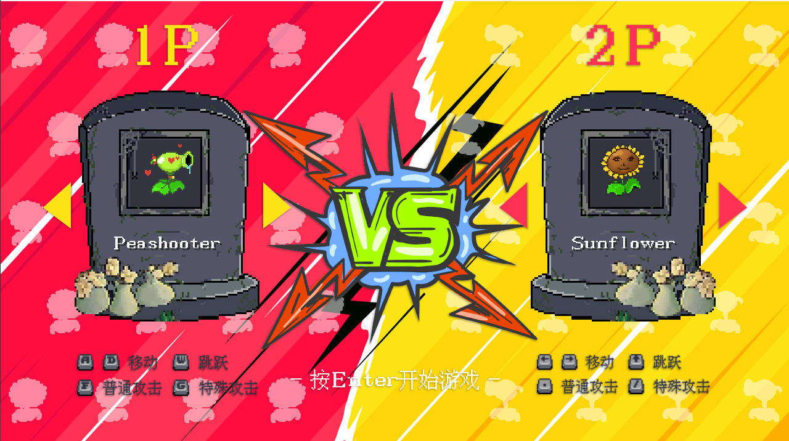
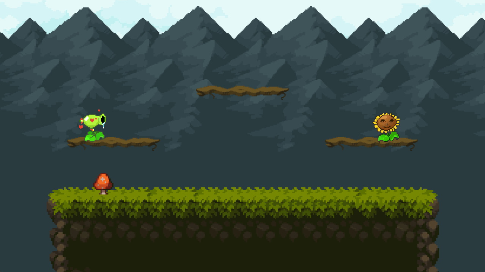
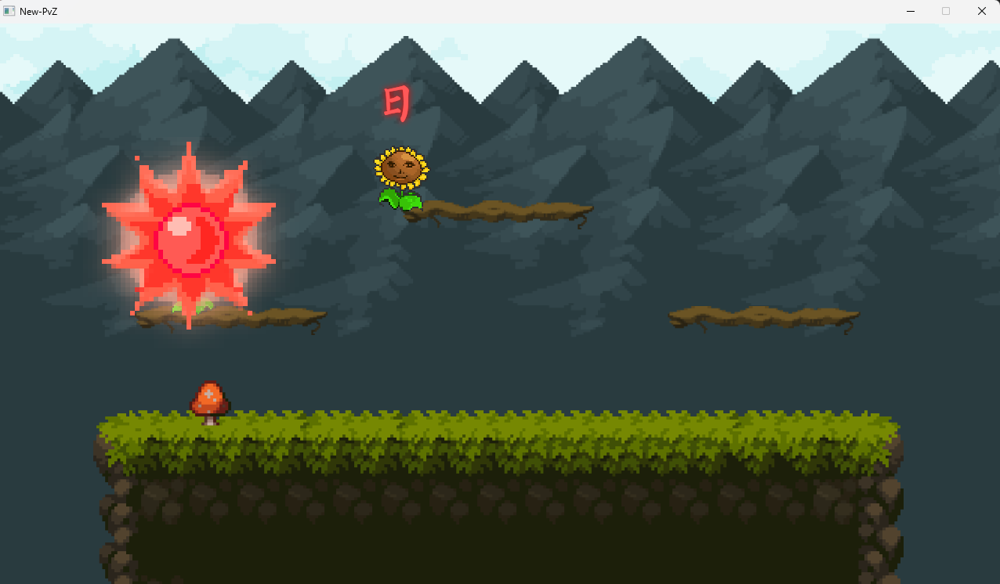

# 🌱 New-PvZ - A PvZ-Inspired 2D Fighting Game

**Language**: C++  
**Graphics Library**: EasyX  
**Paradigm**: Object-Oriented Programming  
**Engine**: Custom scene-based framework with animation and physics systems

---

## 🎮 Overview

New-PvZ is a 2D fighting game prototype that reimagines characters from the classic "Plants vs. Zombies" universe as combatants in a real-time, side-scrolling environment. Designed using object-oriented principles, this project features a modular scene system, real-time animations, physics-based bullet mechanics, and player interaction effects.

---

## 🖼️ Screenshots

---

## 🧩 Core Architecture

### 🔁 Scene System
- Implements a `Scene` base class defining a standard lifecycle:
  - `on_enter`: scene initialization
  - `on_exit`: teardown/cleanup
  - `on_update`, `on_draw`, `on_input`: core game loop hooks
- Each scene (e.g., menu, selection, combat) inherits from this base and customizes its behavior.
- A `SceneManager` handles switching between active scenes.

### 📂 Resource Management
- `Atlas` class functions as a container for bulk-loading and storing animation image assets.

### 🎞️ Animation System
- `Animation` class manages playback state, frame timing, loop behavior, and completion.
- Works in tandem with `Atlas` to render the correct frame dynamically.

### 🎥 Camera System
- `Camera` provides relative positioning for render targets.
- Later stages of the project introduced screen shake for enhanced feedback.

### ⏱️ Timer and `Vector2`
- `Timer`: Manages cooldowns, durations, and invincibility frames.
- `Vector2`: Utility class for 2D vector math used in physics and positioning.

---

## 🧑‍🌾 Player System

### 🎭 Player Base Class
- Supports multiple states (idle, run, attack, death) with associated animations.
- Particle effects appear during jumping, landing, and running.
- Logical combat structure:
  - Normal and special attacks governed by cooldown timers and energy meters.
  - `move_and_collide` encapsulates motion, gravity, and collision with platforms and bullets.

### 🪴 Subclassed Characters
- Each subclass redefines visual assets, projectile logic, and special attacks.
- Includes randomized sound effects for immersive variation.

---

## 🔫 Bullet System

### Bullet Base Class
- Bullet instances track velocity, position, damage, collision target, and resolution logic.
- Implements physics-based movement, including gravity and parabolic trajectory.

### Specialized Bullet Types
- **PeaBullet**: Adds custom break logic, sound effects, and conditional rendering for broken state.
- **SunBullet**: Simulates falling motion under gravity; explosion centers aligned post-impact.
- **SunBulletEX**: A variant that falls at a constant speed, with larger area-of-effect and distinct animation.

---

## ✨ Additional Components

### 🎆 Particle System
- Modeled as animation objects with a self-terminating lifecycle upon animation completion.

### 🪵 Platform
- Logical ground represented as a horizontal line.
- Renders with platform image; toggles additional debug info if enabled.

### 📊 Status Bar
- Displays real-time player status: avatar, health, and energy levels.

### 🐞 Debug Mode
- Press `Q` to activate: shows hitboxes, FPS, and other internal state visualizations.

---

## 🚀 How to Build & Run

1. Clone the repository.
2. Open the project in **Visual Studio 2022** (or later).
3. Ensure **EasyX** graphics library is correctly set up.
4. Build and run the game.

---

## 🛠️ Future Improvements

- Add AI opponents for PvE mode.
- Implement a skill tree or character customization.
- Support for online multiplayer via sockets or networking library.
- UI/UX improvements including menus and transitions.

---

## 👨‍💻 Author

Created by **Karthus Chen**, a passionate developer and fighting game enthusiast.  
Inspired by PvZ, Riot’s 2XKO, and a deep love for fighting games.

